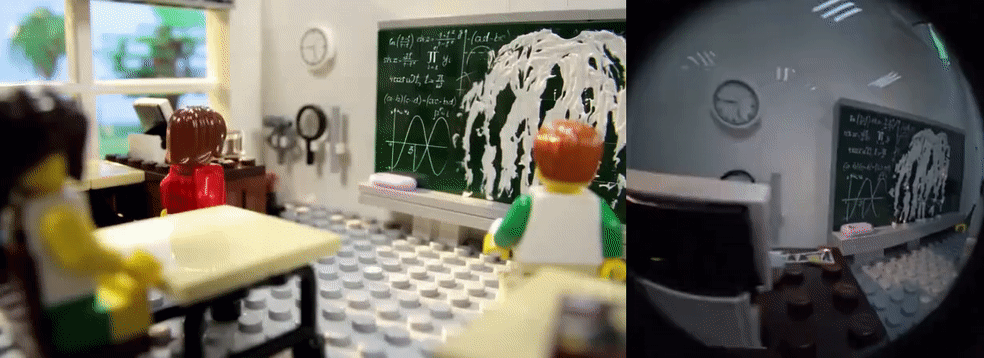

# <p align="center"> LEGO: A Lifting-Free Approach for Exocentric-to-Egocentric Video Generation</p>

## [Project Page](https://suhwan-cho.github.io/LEGO/) &nbsp;|&nbsp; Paper (coming soon)



This is the official code for the paper "LEGO: A Lifting-Free Approach for Exocentric-to-Egocentric Video Generation".

## Regarding Code Release
We are polishing the code and will release it soon!

## Citation
```bibtex
coming soon!
```
